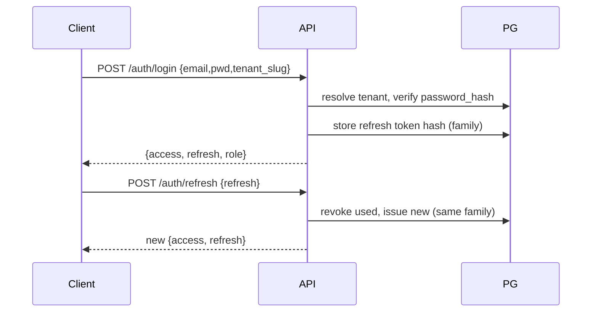
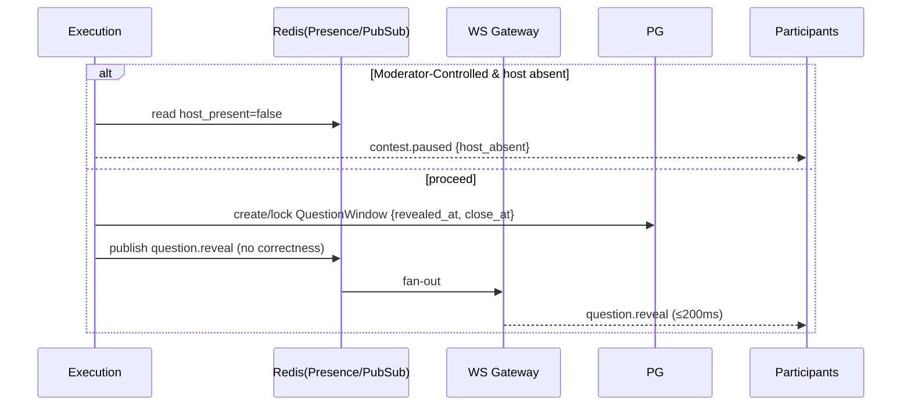
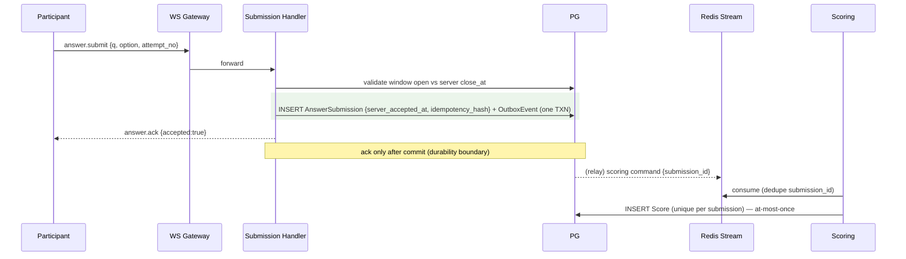
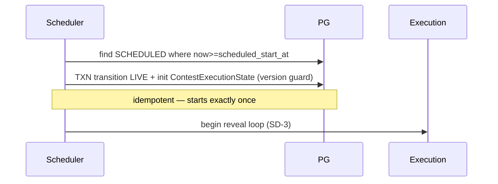

# ContestForge — AIDLC Phase 16: Sequence Diagrams

| | |
|---|---|
| **Phase** | 16 of 25 — Sequence Diagrams |
| **Status** | Draft — for review/approval |
| **Date** | 2026-06-23 |
| **Depends on** | Phases 3 (Use Cases), 4 (Data Flows), 15 (WS) |
| **Feeds** | Implementation, testing |

---

## Goal
Provide **timing-ordered sequence diagrams** for the critical flows, making component interactions and
the durability/idempotency ordering explicit for implementation and tests.

## Assumptions
- Components: Web/Client, REST API, WS Gateway, Execution/Scoring/Leaderboard/Elimination workers,
  Redis (Stream/PubSub/ZSET/Presence/Dedupe), PostgreSQL. Mermaid notation.

## Functional Requirements

### SD-1 Login + refresh


### SD-2 Live join + reconnect
```mermaid
sequenceDiagram
  participant C as Participant
  participant API
  participant WS as WS Gateway
  participant R as Redis
  participant PG
  C->>API: POST /live-ticket (Bearer)
  API->>PG: validate registration
  API->>R: store single-use ticket (TTL)
  API-->>C: {ticket}
  C->>WS: connect (Sec-WebSocket-Protocol: ticket.x)
  WS->>R: consume+invalidate ticket; set presence
  WS-->>C: snapshot (current Q, close_at, my score)
  Note over C,WS: drop → re-ticket → reconnect → snapshot ≤3s
```

### SD-3 Question reveal (Auto + Moderator + auto-pause)


### SD-4 Answer submission (durability + idempotency) — critical


### SD-5 Scoring → leaderboard
```mermaid
sequenceDiagram
  participant SC as Scoring
  participant PG
  participant LB as Leaderboard
  participant Z as Redis ZSET
  participant Cs as Clients
  SC->>PG: read submission + ConfigurationBlock
  SC->>PG: write Score (floor 0; Fixed/Time-Based; SC/Skip); upsert summary
  SC->>LB: signal
  LB->>Z: update view ZSET(s)
  LB-->>Cs: leaderboard.update (per freq/visibility; masked=own rank)
```

### SD-6 Elimination checkpoint
```mermaid
sequenceDiagram
  participant EX as Execution
  participant EL as Elimination
  participant PG
  participant LB as Leaderboard
  participant Cs as Clients
  EX->>EL: checkpoint.reached
  EL->>PG: read authoritative scores
  EL->>EL: evaluate rules (AND/OR); bottom-X tie=all
  EL->>PG: EliminationEvent[] + Registration=ELIMINATED + lock survivors + Outbox
  EL-->>Cs: elimination.event + notifications
  EL->>LB: refresh Survivor view
  EX-->>Cs: contest.progress (between-groups pause)
```

### SD-7 Automatic go-live


### SD-8 Recovery after crash
```mermaid
sequenceDiagram
  participant W as Workers
  participant PG
  participant ST as Redis Stream
  participant Z as Redis ZSET
  W->>PG: reload ContestExecutionState + open QuestionWindows
  W->>PG: re-drive answer_submission WHERE scored=false (idempotent)
  W->>ST: replay PENDING OutboxEvents
  W->>Z: rebuild ZSETs from Score/summary (if cache lost)
  Note over W,PG: resume ≤30s; totals identical; ranks unchanged
```

## Non-functional Requirements
- Diagrams make the **durability boundary** (SD-4) and **at-most-once** (SD-4/SD-5) ordering explicit.
- Latency targets annotated (reveal ≤200ms, reconnect ≤3s).

## Edge Cases
- Ack lost after commit → client retry hits idempotency unique (SD-4).
- Duplicate scoring command → deduped (SD-5).
- Host reconnect resumes paused reveal (SD-3).
- Stale Execution leader write rejected by version guard (SD-7/SD-8).

## Future Considerations
- Add diagrams for bulk import, export, notification fan-out as needed.

## Risks
- **Implementation diverging from sequence** → diagrams referenced in code review + tests.

## Deliverables
- **D1** 8 sequence diagrams (SD-1..SD-8) for login, join/reconnect, reveal, submission, scoring,
  elimination, go-live, recovery.
- **D2** Boundary/latency annotations tying to NFRs.

---
> **Next phase:** Phase 17 — Security Design.
