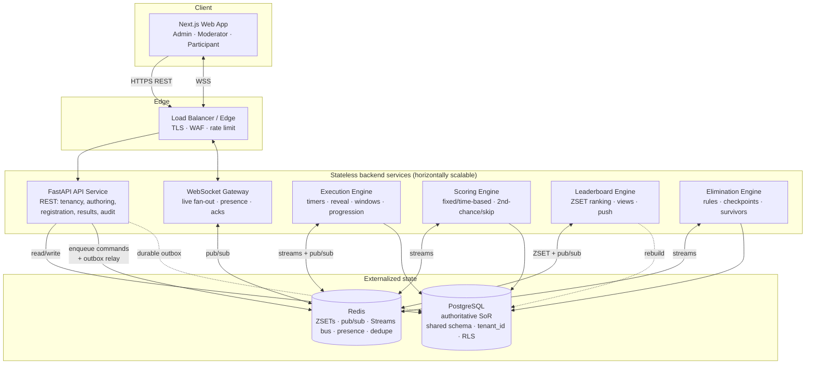

# ContestForge — Architecture

| | |
|---|---|
| **Project** | ContestForge |
| **Source** | docs/kickoff.md, docs/spec/* |
| **Date** | 2026-06-22 |
| **Status** | Draft — for approval |

---

## 1. Overview

ContestForge is a multi-tenant, full-stack live contest engine. The backend is
a set of **stateless, horizontally scalable Python/FastAPI services** with all
state externalized to **PostgreSQL** (authoritative system of record) and
**Redis** (rebuildable cache, pub/sub fan-out, and a Redis-Streams command
bus). A separate **WebSocket gateway** handles live participation; **engine
workers** (Execution, Scoring, Leaderboard, Elimination) run the
server-authoritative contest logic. The frontend is a **Next.js/TypeScript**
web app. The system is **deployment-agnostic** — services are 12-factor
containers that run unchanged on any container platform and region (ADR-003);
deployment topology is not fixed here.

---

## 2. Component Diagram

Command transport between services is **Redis Streams** (durable, at-least-once)
with idempotent consumers; the transactional **outbox** in PostgreSQL is the
durability boundary (ADR-002). Workers are partitioned by `contest_id` hash.

---

## 3. Component Responsibilities

### Next.js Web App
- **Owns:** all UI — super-admin/org consoles, contest builder, moderator
  console, participant live view; renders server timers as display only.
- **Not:** any authoritative timing, scoring, or ranking; never trusted by the
  server.

### FastAPI API Service
- **Owns:** REST endpoints (tenancy, users, contests, configuration, questions,
  registration, results, notifications, audit); JWT issue/verify; RBAC; tenant
  context resolution; durable answer write is initiated here on the WS path's
  behalf where applicable; outbox writes.
- **Not:** live fan-out (WS gateway), authoritative timing/scoring (engines).

### WebSocket Gateway
- **Owns:** participant/moderator WS connections, authentication on connect,
  subscription to per-contest Redis pub/sub channels, fan-out within ≤200 ms
  (NFR-1), presence, reconnection restore (≤3 s, NFR-7), answer-submit intake
  with durable persistence + ack.
- **Not:** scoring or progression decisions (delegates to engines via Streams).

### Execution Engine (worker)
- **Owns:** server-authoritative timers, reveal scheduling (Automatic /
  Moderator-Controlled), `QuestionWindow` open/close times, per-question and
  per-group progression, moderator overrides, `ContestExecutionState` (durable
  resume point), wildcard usage/cooldown/carryover state.
- **Not:** computing points (Scoring), removing participants (Elimination).

### Scoring Engine (worker)
- **Owns:** Mode-derived scoring (Fixed / Time-Based bands or linear decay),
  Second-Chance/Skip adjustments, negative marking, tie-break data capture,
  group-score rollup, at-most-once scoring per accepted answer.
- **Not:** ranking presentation (Leaderboard), durability of the raw answer
  (API/WS gateway + Postgres).

### Leaderboard Engine (worker)
- **Owns:** Redis sorted sets per view (Contest/Group/Survivor), ranking
  criterion + tie display, visibility (incl. Masked redaction), update
  frequency, push to subscribers, rebuild from Postgres on cache loss.
- **Not:** computing scores (Scoring), eliminations (Elimination).

### Elimination Engine (worker)
- **Owns:** rule evaluation at checkpoints (block-level AND/OR), eliminated/
  survivor set computation, survivor-list lock, score reset/carry-forward,
  spectator grant, elimination notifications.
- **Not:** active outside Elimination-mode blocks.

### PostgreSQL
- **Owns:** authoritative record for all tenant data and accepted answers; the
  transactional outbox; durability/recovery source of truth.

### Redis
- **Owns:** leaderboard ZSETs, WS pub/sub fan-out, the Streams command bus,
  presence, idempotency/dedupe keys. Always rebuildable; never sole source.

---

## 4. Data Flow (summary)

The authoritative paths are specified in `technical-spec.md §3`; consolidated:

1. **Answer submission:** WS gateway validates window/eligibility → durable
   write to Postgres (server-accept timestamp + idempotency key) → ack to
   participant → outbox/Streams command → Scoring Engine (idempotent) → score
   row → Leaderboard Engine → ZSET update → push.
2. **Question reveal:** Execution Engine sets `QuestionWindow` → publishes to
   Redis pub/sub → WS gateway fans out ≤200 ms.
3. **Elimination checkpoint:** Execution Engine signals Elimination Engine →
   rules evaluated against authoritative scores → eliminated set persisted →
   survivor list locked → notifications → Survivor Leaderboard refresh →
   progression.
4. **Recovery:** on restart, workers reload `ContestExecutionState` + durable
   rows; unscored answers re-driven idempotently; Redis ZSETs rebuilt from
   Score rows.

---

## 5. Integration Points

- **External systems:** none required for v1. Notifications are emitted as
  in-app WebSocket events; email/SMS/webhook transport is deferred
  (product-spec §6, §8).
- **Result export** (`/contests/{id}/results/export`) streams CSV/JSON from the
  API; object-storage offload is optional and not required for v1.
- **Internal contracts:** REST + WebSocket per `api-contracts.yaml`/`.md`;
  inter-service commands via Redis Streams envelopes carrying `tenant_id`.

---

## 6. Observability

Per `technical-spec.md §6`:
- **Structured JSON logs** with correlation id, `tenant_id`, `contest_id`,
  `participant_id`; never secrets/JWTs.
- **Audit log** (durable, queryable via `/audit`) for org create/suspend,
  lifecycle transitions, wildcard activations, eliminations, tie-break
  resolutions.
- **Metrics:** reveal fan-out latency, leaderboard push latency, answer-accept
  rate, scoring lag, Streams depth, WS connection count, recovery duration —
  alerted against NFR thresholds.
- **Tracing:** distributed traces across API/WS → Streams → workers, adaptive
  sampling (100% errors, 1–10% normal).
- **Health/readiness:** `/health`, `/ready` (DB + Redis checks) on every
  service.
- **Tooling:** OpenTelemetry SDK → CloudWatch (or Prometheus/Grafana),
  platform-agnostic.

---

## 7. Deployment Overview (deployment-agnostic — ADR-003)

- **Principle:** every backend service is stateless and horizontally scalable;
  all durable/coordination state lives in Postgres and Redis. No service holds
  contest state in memory beyond a recoverable cache. This lets the same
  containers run on any container platform (Fargate, EKS, plain Docker,
  on-prem) and any region without code change.
- **Scaling:** each service scales independently. The WS gateway scales on
  connection count; Execution/Scoring/Leaderboard/Elimination workers scale on
  Streams consumer-group lag; the API on request rate. Engine workers are
  partitioned by `contest_id` hash so a contest's processing is isolated.
- **Environments:** `dev`, `staging`, `production` (see `infra.yaml`).
- **Region:** single-region for v1, supplied as configuration; not pinned in
  the architecture (per-tenant region is a later release).
- **What is intentionally deferred:** concrete compute platform, instance
  sizing, autoscaling thresholds, and IaC — decided at provisioning/init time,
  not here.

---

## 8. Cross-cutting Concerns

- **Multi-tenancy (ADR-001):** shared schema, `tenant_id` on every tenant-scoped
  row, SQLAlchemy scoping mixin + Postgres RLS, composite FKs `(tenant_id,
  parent_id)`; cross-tenant access → 403 + security log.
- **Durability (ADR-002):** transactional outbox + Redis Streams + idempotent
  consumers give at-least-once delivery and at-most-once scoring.
- **Security:** JWT access/refresh (rotating), argon2/bcrypt password hashing,
  RBAC per endpoint and WS action, TLS/WSS, edge + app-level rate limiting,
  secrets in a managed store. Detail in `.neutron/security.md`.
- **Compliance:** SOC 2 Type II + GDPR readiness; encryption in transit/at rest;
  PII application-level encryption; tenant soft-delete (30-day grace) then
  cascade hard-delete.
