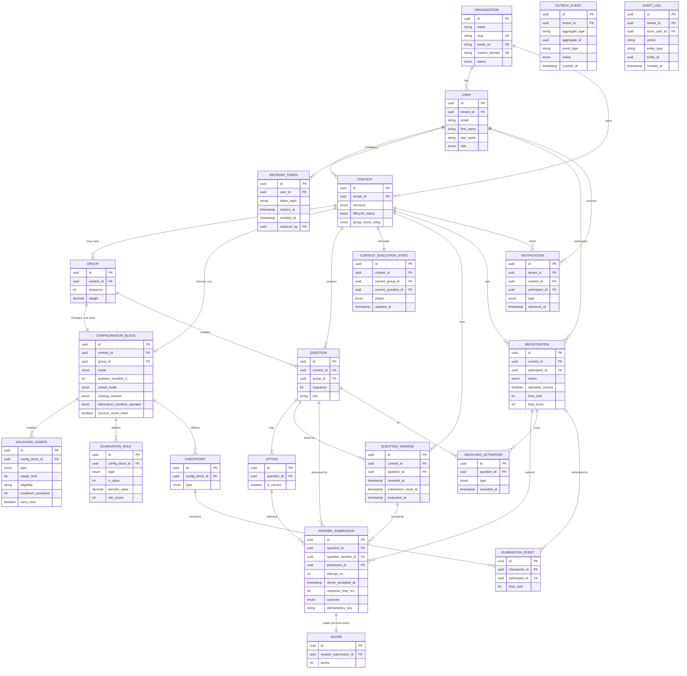

# ContestForge — Domain Model

| | |
|---|---|
| **Project** | ContestForge |
| **Source** | docs/spec/product-spec.md, docs/spec/technical-spec.md |
| **Date** | 2026-06-19 |
| **Status** | Draft — for approval |

---

## 1. Bounded Contexts

ContestForge has five cohesive sub-domains within one service:

1. **Tenancy & Identity** — Organization, User, RefreshToken, roles,
   authentication.
2. **Contest Authoring** — Contest, Group, ConfigurationBlock, WildcardConfig,
   Question, Option.
3. **Live Execution & Scoring** — Registration, ContestExecutionState,
   QuestionWindow, AnswerSubmission, Score, WildcardActivation,
   LeaderboardEntry.
4. **Elimination** — Checkpoint, EliminationRule, EliminationEvent.
5. **Platform Cross-Cutting** — OutboxEvent, Notification, AuditLog (durable
   messaging, participant notifications, and audit trail).

All tenant-scoped entities carry `tenant_id` (Organization id). `User` with
role `SUPER_ADMIN` is platform-scoped (no tenant).

---

## 2. Core Entities

### Tenancy & Identity

**Organization (Tenant)**
- `id` (UUID, PK)
- `name` (string)
- `slug` (string, unique, not null) — tenant key; used as the login
  `tenant_slug` and as the subdomain label (e.g. `acme`)
- `portal_url` (string, unique, not null) — canonical tenant portal URL
  (e.g. `https://acme.contestforge.com`)
- `custom_domain` (string, unique, nullable) — optional vanity/white-label
  domain (e.g. `quiz.acme.edu`)
- `status` (enum: ACTIVE | SUSPENDED)
- `created_by` (User id — Super Admin)
- `created_at`, `updated_at` (timestamp)

**User**
- `id` (UUID, PK)
- `tenant_id` (UUID, FK → Organization; null for SUPER_ADMIN)
- `email` (string) — unique within tenant; see composite unique below
- `password_hash` (string)
- `role` (enum: SUPER_ADMIN | ORG_ADMIN | MODERATOR | PARTICIPANT)
- `first_name` (string, not null)
- `last_name` (string, not null)
- `status` (enum: ACTIVE | DISABLED)
- `created_at`, `updated_at`
- *Constraint:* composite unique `(tenant_id, email)` — an email is unique
  within a tenant; the same email may exist across tenants. `SUPER_ADMIN` rows
  have `tenant_id = NULL` and are globally unique by email.

**RefreshToken** *(JWT refresh rotation — FR-4)*
- `id` (UUID, PK)
- `user_id` (UUID, FK → User)
- `tenant_id` (UUID, FK → Organization, nullable for SUPER_ADMIN)
- `token_hash` (string — hashed, never stored in plaintext)
- `issued_at`, `expires_at` (timestamp)
- `revoked_at` (timestamp, nullable)
- `replaced_by` (UUID, FK → RefreshToken, nullable — set on rotation)

### Contest Authoring

**Contest**
- `id` (UUID, PK)
- `tenant_id` (UUID, FK → Organization)
- `name`, `description` (string)
- `structure` (enum: NORMAL | GROUPED)
- `lifecycle_status` (enum: DRAFT | PUBLISHED | REGISTRATION_OPEN |
  REGISTRATION_CLOSED | SCHEDULED | LIVE | COMPLETED | ARCHIVED)
- `scheduled_start_at` (timestamp, nullable)
- `group_score_rollup` (enum: SUM | WEIGHTED_SUM | BEST_N; Grouped only)
- `rollup_best_n` (int, nullable; when BEST_N)
- `created_by` (User id), `created_at`, `updated_at`

**Group** (Grouped contests only)
- `id` (UUID, PK)
- `contest_id` (UUID, FK → Contest)
- `name` (string)
- `sequence` (int — run order)
- `weight` (decimal, nullable; for WEIGHTED_SUM)

**ConfigurationBlock**
- `id` (UUID, PK)
- `contest_id` (UUID, FK → Contest) — set when scope = CONTEST (Normal)
- `group_id` (UUID, FK → Group, nullable) — set when scope = GROUP (Grouped)
- `mode` (enum: STANDARD | SPEED | ELIMINATION)
- `question_duration_s` (int, 5–300)
- `question_interval_s` (int, 0–60)
- `explanation_duration_s` (int, 0–60)
- `leaderboard_duration_s` (int, 0–60)
- `reveal_mode` (enum: AUTOMATIC | MODERATOR_CONTROLLED)
- `ranking_criterion` (enum: SCORE_ONLY | SCORE_TIME | ACCURACY)
- `tie_display` (enum: SHARED_RANK | FASTEST | LEAST_INCORRECT)
- `leaderboard_visibility` (enum: ALWAYS | POST_QUESTION | HIDDEN | MASKED)
- `update_frequency` (enum: PER_ANSWER | PER_QUESTION | PER_GROUP)
- `elimination_combine_operator` (enum: AND | OR, nullable) — single top-level
  operator combining all of the block's EliminationRules (ELIMINATION mode only)
- `survivor_score_reset` (boolean, default false) — when true, survivors' scores
  reset at the start of the next group instead of carrying forward (FR-37)
- **Scoring config (derived by mode):**
  - `correct_points` (int, default 10; Fixed)
  - `wrong_points` (int, default 0; may be negative; Fixed)
  - `second_chance_rate` (decimal, default 0.5)
  - `time_bands` (json; Speed) or `decay` `{max_points, floor, decay_rate}`
    (Speed)
- *Invariant:* exactly one of (`contest_id` scope, `group_id` scope) applies;
  scoring model is derived from `mode` and not stored independently.

**WildcardConfig** *(per Configuration Block — FR-26)*
- `id` (UUID, PK)
- `config_block_id` (UUID, FK → ConfigurationBlock)
- `type` (enum: FIFTY_FIFTY | SECOND_CHANCE | SKIP)
- `usage_limit` (int — max uses per participant per quiz/group)
- `eligibility` (string — e.g. `ALL` | `TOP_50_PERCENT`)
- `cooldown_questions` (int — minimum questions between same-wildcard uses)
- `carry_over` (boolean — whether the wildcard carries to the next group or
  resets; Grouped only)
- *Constraint:* unique `(config_block_id, type)` — at most one config per
  wildcard type per block.

**Question**
- `id` (UUID, PK)
- `tenant_id` (UUID, FK → Organization)
- `contest_id` (UUID, FK → Contest)
- `group_id` (UUID, FK → Group, nullable; Grouped)
- `sequence` (int)
- `text` (string)
- `explanation` (string, nullable)
- `created_at`, `updated_at`
- *Note:* runtime reveal timing is recorded per run in **QuestionWindow**, not
  on the authored question.

**Option**
- `id` (UUID, PK)
- `question_id` (UUID, FK → Question)
- `text` (string)
- `is_correct` (boolean)
- `ordinal` (int)

### Live Execution & Scoring

**ContestExecutionState** *(durable live-execution state — recovery, FR-42/NFR-6)*
- `id` (UUID, PK)
- `tenant_id` (UUID, FK → Organization)
- `contest_id` (UUID, FK → Contest, unique — one row per contest)
- `current_group_id` (UUID, FK → Group, nullable)
- `current_question_id` (UUID, FK → Question, nullable)
- `phase` (enum: DISPLAY | SUBMISSION | EVALUATION | EXPLANATION | LEADERBOARD |
  INTERVAL | BETWEEN_GROUPS | ENDED)
- `started_at`, `updated_at` (timestamp)
- *Purpose:* the single durable source the Execution Engine reads on restart to
  resume a Live contest without loss or double-progression.

**QuestionWindow** *(authoritative server-side timing per question run)*
- `id` (UUID, PK)
- `tenant_id` (UUID, FK → Organization)
- `contest_id` (UUID, FK → Contest)
- `question_id` (UUID, FK → Question)
- `revealed_at` (timestamp — when the question was revealed)
- `submission_close_at` (timestamp — authoritative close time; FR-20)
- `evaluated_at` (timestamp, nullable)
- *Constraint:* unique `(contest_id, question_id)`. This is the authority for
  accepting/rejecting late answers and for recovering open windows after a crash.

**Registration**
- `id` (UUID, PK)
- `tenant_id` (UUID, FK → Organization)
- `contest_id` (UUID, FK → Contest)
- `participant_id` (UUID, FK → User)
- `status` (enum: REGISTERED | ACTIVE | ELIMINATED | COMPLETED)
- `registered_at`
- `joined_at` (timestamp, nullable — when the participant joined the Live run)
- `spectator_access` (boolean, default false — view-only access after
  elimination, FR-37)
- `final_rank` (int, nullable — set at contest completion)
- `final_score` (int, nullable — set at contest completion)

**AnswerSubmission** *(durable answer record — durability boundary)*
- `id` (UUID, PK)
- `tenant_id` (UUID, FK → Organization)
- `contest_id`, `question_id`, `participant_id` (UUID, FKs)
- `question_window_id` (UUID, FK → QuestionWindow — the authoritative window
  this submission was evaluated against)
- `attempt_no` (int; 1 = first, 2 = Second Chance)
- `selected_option_id` (UUID, FK → Option, nullable for skip/timeout)
- `server_accepted_at` (timestamp — authoritative scoring time, FR-40)
- `response_time_ms` (int — from reveal to accept; for Speed/tie-break)
- `outcome` (enum: CORRECT | WRONG | TIMEOUT | SKIPPED)
- `idempotency_key` (string, unique: `contest|question|participant|attempt`)

**Score**
- `id` (UUID, PK)
- `tenant_id`, `contest_id`, `participant_id` (UUID, FKs)
- `group_id` (UUID, nullable)
- `answer_submission_id` (UUID, FK → AnswerSubmission, unique — at-most-once)
- `points` (int)
- `scored_at` (timestamp)

**WildcardActivation**
- `id` (UUID, PK)
- `tenant_id`, `contest_id`, `question_id`, `participant_id` (UUID, FKs)
- `type` (enum: FIFTY_FIFTY | SECOND_CHANCE | SKIP)
- `activated_at` (timestamp)
- `outcome` (string — e.g. options removed, points effect)

**LeaderboardEntry** *(materialized/cached in Redis; rebuildable)*
- `contest_id`, `group_id` (nullable), `view` (CONTEST | GROUP | SURVIVOR)
- `participant_id`
- `score`, `total_time_ms`, `wrong_count`, `last_correct_at`
- `rank`

### Elimination

**EliminationRule**
- `id` (UUID, PK)
- `config_block_id` (UUID, FK → ConfigurationBlock)
- `type` (enum: FIRST_WRONG | N_WRONG | BOTTOM_X_PERCENT | MIN_SCORE)
- `n_value` (int, nullable; N_WRONG, default 3)
- `percent_value` (decimal, nullable; BOTTOM_X_PERCENT)
- `min_score` (int, nullable; MIN_SCORE)
- *Note:* how multiple rules combine is set once at the block level via
  `ConfigurationBlock.elimination_combine_operator` (AND | OR), not per rule.

**Checkpoint**
- `id` (UUID, PK)
- `config_block_id` (UUID, FK → ConfigurationBlock)
- `type` (enum: AFTER_QUESTION | AFTER_GROUP | CUSTOM_MILESTONE)
- `question_sequence` (int, nullable; AFTER_QUESTION)
- `milestone_at` (timestamp, nullable; CUSTOM_MILESTONE)

**EliminationEvent**
- `id` (UUID, PK)
- `tenant_id`, `contest_id`, `participant_id` (UUID, FKs)
- `checkpoint_id` (UUID, FK → Checkpoint)
- `final_rank` (int), `final_score` (int)
- `eliminated_at` (timestamp)
- `spectator_granted` (boolean)

### Platform Cross-Cutting

**OutboxEvent** *(transactional outbox — durable, at-least-once messaging)*
- `id` (UUID, PK)
- `tenant_id` (UUID, FK → Organization, nullable for platform events)
- `aggregate_type` (string — e.g. `AnswerSubmission`, `Contest`)
- `aggregate_id` (UUID — id of the originating entity)
- `event_type` (string — e.g. `answer.accepted`, `checkpoint.reached`)
- `payload` (jsonb)
- `status` (enum: PENDING | PROCESSED | DEAD_LETTER)
- `created_at` (timestamp), `processed_at` (timestamp, nullable)
- *Purpose:* events are written in the same transaction as the state change and
  relayed to engine workers/notifications, giving at-least-once delivery and
  reconciliation after a crash (technical-spec command channel).

**Notification** *(participant-facing — FR-37, FR-41)*
- `id` (UUID, PK)
- `tenant_id` (UUID, FK → Organization)
- `contest_id` (UUID, FK → Contest)
- `participant_id` (UUID, FK → User)
- `type` (enum: ELIMINATION | ANSWER_ACK | SPECTATOR_GRANTED | CONTEST_PROGRESS)
- `payload` (jsonb — e.g. final rank/score for ELIMINATION)
- `created_at` (timestamp), `delivered_at` (timestamp, nullable)

**AuditLog** *(audit trail — technical-spec §6)*
- `id` (UUID, PK)
- `tenant_id` (UUID, FK → Organization, nullable for platform-level actions
  such as org create/suspend)
- `actor_user_id` (UUID, FK → User)
- `action` (string — e.g. `org.create`, `contest.lifecycle.transition`,
  `tiebreak.resolved`, `participant.eliminated`)
- `entity_type` (string), `entity_id` (UUID)
- `metadata` (jsonb)
- `created_at` (timestamp)

---

## 3. Entity Relationship Diagram

> `OUTBOX_EVENT` and `AUDIT_LOG` are intentionally loosely coupled (referenced
> by `aggregate_id` / `entity_id` rather than hard FKs) so they can record
> events across any aggregate without coupling the write path to every table.

---

## 4. Business Rules

- **BR-1 (Tenant isolation):** Every tenant-scoped query is filtered by
  `tenant_id`; no entity may reference another tenant's entity. (FR-3)
- **BR-2 (Structure ↔ config placement):** Normal → exactly one
  ConfigurationBlock at contest scope; Grouped → exactly one ConfigurationBlock
  per Group. (FR-8)
- **BR-3 (Mode → scoring):** STANDARD and ELIMINATION ⇒ Fixed scoring; SPEED ⇒
  Time-Based. Scoring model is never set independently of `mode`. (FR-12)
- **BR-4 (Elimination requires rules):** ELIMINATION mode blocks must have ≥1
  EliminationRule, ≥1 Checkpoint, and a non-null
  `elimination_combine_operator` (AND | OR) that combines all of the block's
  rules; non-ELIMINATION blocks ignore them. (FR-10, FR-33, FR-34)
- **BR-5 (Lifecycle monotonicity):** lifecycle_status advances only through the
  fixed sequence; no skipping. Structure locks at PUBLISHED; ConfigurationBlock
  locks at REGISTRATION_OPEN. (FR-7, FR-9)
- **BR-6 (Config field ranges):** durations honor PRD bounds (question 5–300s;
  interval/explanation/leaderboard 0–60s). (FR-10)
- **BR-7 (Authoritative timestamp):** `AnswerSubmission.server_accepted_at` is
  set once, at first server acceptance, and is the scoring/tie-break time even
  after retries. (FR-40)
- **BR-8 (At-most-once scoring):** `Score.answer_submission_id` is unique; a
  given AnswerSubmission yields exactly one Score. (FR-39)
- **BR-9 (Late submission):** an answer with accept time after the server-side
  window close is rejected (recorded as TIMEOUT or not accepted). (FR-20)
- **BR-10 (Second Chance):** only one extra attempt (attempt_no = 2) after a
  WRONG first attempt; scored at `second_chance_rate`. (FR-24)
- **BR-11 (Fifty-Fifty timing):** cannot be activated after an answer is
  selected; always preserves the correct option. (FR-23)
- **BR-12 (Skip scoring):** Skip awards full correct points under Fixed, floor
  score under Speed. (FR-25)
- **BR-13 (Wildcard limits):** activations respect enabled set, usage limit,
  eligibility, cooldown, and group carryover/reset. (FR-26)
- **BR-14 (Tie-break order):** fastest total time → fewest wrong → earliest last
  correct submission; deterministic and logged. (FR-15)
- **BR-15 (Group rollup):** contest score computed by the contest's rollup
  strategy (SUM | WEIGHTED_SUM | BEST_N). (FR-16)
- **BR-16 (Elimination effect):** once an EliminationEvent exists for a
  participant, their Registration.status = ELIMINATED and no further
  AnswerSubmissions are accepted. (FR-36)
- **BR-17 (Survivor carry-forward):** survivors retain accumulated scores across
  groups unless a reset is configured. (FR-37)
- **BR-18 (Leaderboard recoverability):** LeaderboardEntry is derived state;
  rebuilt from Score rows on cache loss without affecting scores/ranks. (FR-44)
- **BR-19 (Tenant routing identity):** `Organization.slug` and `portal_url` are
  unique platform-wide and immutable once the tenant has published its first
  contest; `custom_domain`, if set, is also unique. (FR-1)
- **BR-20 (Refresh-token rotation):** on use, a RefreshToken is revoked
  (`revoked_at` set) and a new token issued with `replaced_by` linking the
  chain; a revoked or expired token is never accepted. (FR-4)
- **BR-21 (Authoritative window):** an AnswerSubmission is accepted only if
  `server_accepted_at ≤ QuestionWindow.submission_close_at` for its
  `question_window_id`; the window is the single timing authority and survives
  restart. (FR-20, FR-40)
- **BR-22 (Resumable execution state):** ContestExecutionState is the single
  durable record the Execution Engine reads to resume a Live contest; on
  recovery it is reconciled only from durable rows (windows, submissions,
  scores), never from cache. (FR-42, NFR-6)
- **BR-23 (At-least-once outbox):** an OutboxEvent is written in the same
  transaction as its state change and marked `PROCESSED` only after the
  downstream consumer acknowledges; unprocessed events are re-driven on
  recovery, and idempotent consumers prevent double effects. (FR-38, FR-39)
- **BR-24 (Survivor score reset):** survivors carry accumulated scores into the
  next group unless the group's `ConfigurationBlock.survivor_score_reset` is
  true. (FR-37)

---

## 5. Scale & Indexing (10,000 concurrent users)

These are documented here as the data-layer strategy for the durability and
latency NFRs; concrete DDL is produced during `/neutron:init`.

- **Time-ordered UUIDs (UUID v7)** for primary keys, to keep B-tree index
  inserts sequential under heavy concurrent writes (avoids the page-split churn
  of random UUID v4 on the answer/score hot path).
- **Key indexes:**
  - `user (tenant_id, email)` unique.
  - `organization (slug)` unique, `organization (portal_url)` unique.
  - `contest (tenant_id, lifecycle_status)`.
  - `registration (contest_id, participant_id)` unique; `(contest_id, status)`.
  - `answer_submission (idempotency_key)` unique; `(contest_id, question_id)`;
    `(participant_id, contest_id)`.
  - `score (answer_submission_id)` unique; `(contest_id, group_id)`.
  - `question_window (contest_id, question_id)` unique.
  - `wildcard_activation (contest_id, participant_id)`.
  - `outbox_event (status, created_at)` partial index `WHERE status = 'PENDING'`
    so the relay scans only undelivered work.
- **Partitioning:** `answer_submission` and `score` are the highest-volume
  tables (up to 10,000 writes per question). Partition both by `contest_id`
  (hash) to spread write load and make post-contest archival a cheap partition
  detach.
- **Tenant isolation at the data layer:** every tenant-scoped table carries
  `tenant_id`; application-level scoping is mandatory (BR-1), with Postgres
  Row-Level Security available as optional defence-in-depth.
