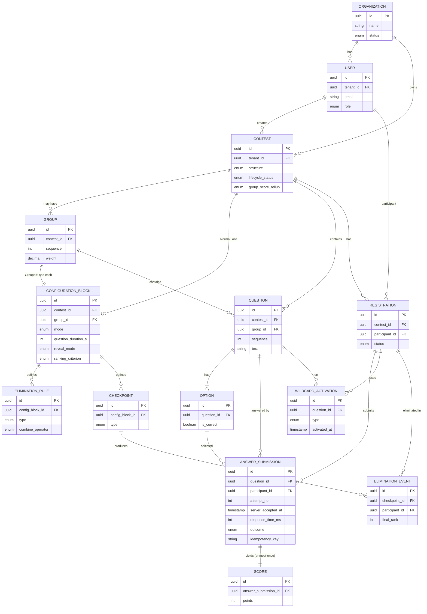

# ContestForge — Domain Model

| | |
|---|---|
| **Project** | ContestForge |
| **Source** | docs/spec/product-spec.md, docs/spec/technical-spec.md |
| **Date** | 2026-06-19 |
| **Status** | Draft — for approval |

---

## 1. Bounded Contexts

ContestForge has four cohesive sub-domains within one service:

1. **Tenancy & Identity** — Organization, User, roles, authentication.
2. **Contest Authoring** — Contest, Group, ConfigurationBlock, Question, Option.
3. **Live Execution & Scoring** — Registration, AnswerSubmission, Score,
   WildcardActivation, LeaderboardEntry.
4. **Elimination** — Checkpoint, EliminationRule, EliminationEvent.

All tenant-scoped entities carry `tenant_id` (Organization id). `User` with
role `SUPER_ADMIN` is platform-scoped (no tenant).

---

## 2. Core Entities

### Tenancy & Identity

**Organization (Tenant)**
- `id` (UUID, PK)
- `name` (string)
- `status` (enum: ACTIVE | SUSPENDED)
- `created_by` (User id — Super Admin)
- `created_at`, `updated_at` (timestamp)

**User**
- `id` (UUID, PK)
- `tenant_id` (UUID, FK → Organization; null for SUPER_ADMIN)
- `email` (string, unique within tenant)
- `password_hash` (string)
- `role` (enum: SUPER_ADMIN | ORG_ADMIN | MODERATOR | PARTICIPANT)
- `display_name` (string)
- `status` (enum: ACTIVE | DISABLED)
- `created_at`, `updated_at`

### Contest Authoring

**Contest**
- `id` (UUID, PK)
- `tenant_id` (UUID, FK → Organization)
- `name`, `description` (string)
- `structure` (enum: NORMAL | GROUPED)
- `lifecycle_status` (enum: DRAFT | PUBLISHED | REGISTRATION_OPEN |
  REGISTRATION_CLOSED | SCHEDULED | LIVE | COMPLETED | ARCHIVED)
- `scheduled_start_at` (timestamp, nullable)
- `group_score_rollup` (enum: SUM | WEIGHTED_SUM | BEST_N; Grouped only)
- `rollup_best_n` (int, nullable; when BEST_N)
- `created_by` (User id), `created_at`, `updated_at`

**Group** (Grouped contests only)
- `id` (UUID, PK)
- `contest_id` (UUID, FK → Contest)
- `name` (string)
- `sequence` (int — run order)
- `weight` (decimal, nullable; for WEIGHTED_SUM)

**ConfigurationBlock**
- `id` (UUID, PK)
- `contest_id` (UUID, FK → Contest) — set when scope = CONTEST (Normal)
- `group_id` (UUID, FK → Group, nullable) — set when scope = GROUP (Grouped)
- `mode` (enum: STANDARD | SPEED | ELIMINATION)
- `question_duration_s` (int, 5–300)
- `question_interval_s` (int, 0–60)
- `explanation_duration_s` (int, 0–60)
- `leaderboard_duration_s` (int, 0–60)
- `reveal_mode` (enum: AUTOMATIC | MODERATOR_CONTROLLED | SCHEDULED)
- `ranking_criterion` (enum: SCORE_ONLY | SCORE_TIME | ACCURACY)
- `tie_display` (enum: SHARED_RANK | FASTEST | LEAST_INCORRECT)
- `leaderboard_visibility` (enum: ALWAYS | POST_QUESTION | HIDDEN | MASKED)
- `update_frequency` (enum: PER_ANSWER | PER_QUESTION | PER_GROUP)
- **Scoring config (derived by mode):**
  - `correct_points` (int, default 10; Fixed)
  - `wrong_points` (int, default 0; may be negative; Fixed)
  - `second_chance_rate` (decimal, default 0.5)
  - `time_bands` (json; Speed) or `decay` `{max_points, floor, decay_rate}`
    (Speed)
- *Invariant:* exactly one of (`contest_id` scope, `group_id` scope) applies;
  scoring model is derived from `mode` and not stored independently.

**Question**
- `id` (UUID, PK)
- `tenant_id` (UUID, FK → Organization)
- `contest_id` (UUID, FK → Contest)
- `group_id` (UUID, FK → Group, nullable; Grouped)
- `sequence` (int)
- `text` (string)
- `explanation` (string, nullable)
- `reveal_at` (timestamp, nullable; Scheduled reveal mode)
- `created_at`, `updated_at`

**Option**
- `id` (UUID, PK)
- `question_id` (UUID, FK → Question)
- `text` (string)
- `is_correct` (boolean)
- `ordinal` (int)

### Live Execution & Scoring

**Registration**
- `id` (UUID, PK)
- `tenant_id` (UUID, FK → Organization)
- `contest_id` (UUID, FK → Contest)
- `participant_id` (UUID, FK → User)
- `status` (enum: REGISTERED | ACTIVE | ELIMINATED | COMPLETED)
- `registered_at`

**AnswerSubmission** *(durable answer record — durability boundary)*
- `id` (UUID, PK)
- `tenant_id` (UUID, FK → Organization)
- `contest_id`, `question_id`, `participant_id` (UUID, FKs)
- `attempt_no` (int; 1 = first, 2 = Second Chance)
- `selected_option_id` (UUID, FK → Option, nullable for skip/timeout)
- `server_accepted_at` (timestamp — authoritative scoring time, FR-40)
- `response_time_ms` (int — from reveal to accept; for Speed/tie-break)
- `outcome` (enum: CORRECT | WRONG | TIMEOUT | SKIPPED)
- `idempotency_key` (string, unique: `contest|question|participant|attempt`)

**Score**
- `id` (UUID, PK)
- `tenant_id`, `contest_id`, `participant_id` (UUID, FKs)
- `group_id` (UUID, nullable)
- `answer_submission_id` (UUID, FK → AnswerSubmission, unique — at-most-once)
- `points` (int)
- `scored_at` (timestamp)

**WildcardActivation**
- `id` (UUID, PK)
- `tenant_id`, `contest_id`, `question_id`, `participant_id` (UUID, FKs)
- `type` (enum: FIFTY_FIFTY | SECOND_CHANCE | SKIP)
- `activated_at` (timestamp)
- `outcome` (string — e.g. options removed, points effect)

**LeaderboardEntry** *(materialized/cached in Redis; rebuildable)*
- `contest_id`, `group_id` (nullable), `view` (CONTEST | GROUP | SURVIVOR)
- `participant_id`
- `score`, `total_time_ms`, `wrong_count`, `last_correct_at`
- `rank`

### Elimination

**EliminationRule**
- `id` (UUID, PK)
- `config_block_id` (UUID, FK → ConfigurationBlock)
- `type` (enum: FIRST_WRONG | N_WRONG | BOTTOM_X_PERCENT | MIN_SCORE)
- `n_value` (int, nullable; N_WRONG, default 3)
- `percent_value` (decimal, nullable; BOTTOM_X_PERCENT)
- `min_score` (int, nullable; MIN_SCORE)
- `combine_operator` (enum: AND | OR — combination within the block)

**Checkpoint**
- `id` (UUID, PK)
- `config_block_id` (UUID, FK → ConfigurationBlock)
- `type` (enum: AFTER_QUESTION | AFTER_GROUP | CUSTOM_MILESTONE)
- `question_sequence` (int, nullable; AFTER_QUESTION)
- `milestone_at` (timestamp, nullable; CUSTOM_MILESTONE)

**EliminationEvent**
- `id` (UUID, PK)
- `tenant_id`, `contest_id`, `participant_id` (UUID, FKs)
- `checkpoint_id` (UUID, FK → Checkpoint)
- `final_rank` (int), `final_score` (int)
- `eliminated_at` (timestamp)
- `spectator_granted` (boolean)

---

## 3. Entity Relationship Diagram

---

## 4. Business Rules

- **BR-1 (Tenant isolation):** Every tenant-scoped query is filtered by
  `tenant_id`; no entity may reference another tenant's entity. (FR-3)
- **BR-2 (Structure ↔ config placement):** Normal → exactly one
  ConfigurationBlock at contest scope; Grouped → exactly one ConfigurationBlock
  per Group. (FR-8)
- **BR-3 (Mode → scoring):** STANDARD and ELIMINATION ⇒ Fixed scoring; SPEED ⇒
  Time-Based. Scoring model is never set independently of `mode`. (FR-12)
- **BR-4 (Elimination requires rules):** ELIMINATION mode blocks must have ≥1
  EliminationRule and ≥1 Checkpoint; non-ELIMINATION blocks ignore them. (FR-10,
  FR-33)
- **BR-5 (Lifecycle monotonicity):** lifecycle_status advances only through the
  fixed sequence; no skipping. Structure locks at PUBLISHED; ConfigurationBlock
  locks at REGISTRATION_OPEN. (FR-7, FR-9)
- **BR-6 (Config field ranges):** durations honor PRD bounds (question 5–300s;
  interval/explanation/leaderboard 0–60s). (FR-10)
- **BR-7 (Authoritative timestamp):** `AnswerSubmission.server_accepted_at` is
  set once, at first server acceptance, and is the scoring/tie-break time even
  after retries. (FR-40)
- **BR-8 (At-most-once scoring):** `Score.answer_submission_id` is unique; a
  given AnswerSubmission yields exactly one Score. (FR-39)
- **BR-9 (Late submission):** an answer with accept time after the server-side
  window close is rejected (recorded as TIMEOUT or not accepted). (FR-20)
- **BR-10 (Second Chance):** only one extra attempt (attempt_no = 2) after a
  WRONG first attempt; scored at `second_chance_rate`. (FR-24)
- **BR-11 (Fifty-Fifty timing):** cannot be activated after an answer is
  selected; always preserves the correct option. (FR-23)
- **BR-12 (Skip scoring):** Skip awards full correct points under Fixed, floor
  score under Speed. (FR-25)
- **BR-13 (Wildcard limits):** activations respect enabled set, usage limit,
  eligibility, cooldown, and group carryover/reset. (FR-26)
- **BR-14 (Tie-break order):** fastest total time → fewest wrong → earliest last
  correct submission; deterministic and logged. (FR-15)
- **BR-15 (Group rollup):** contest score computed by the contest's rollup
  strategy (SUM | WEIGHTED_SUM | BEST_N). (FR-16)
- **BR-16 (Elimination effect):** once an EliminationEvent exists for a
  participant, their Registration.status = ELIMINATED and no further
  AnswerSubmissions are accepted. (FR-36)
- **BR-17 (Survivor carry-forward):** survivors retain accumulated scores across
  groups unless a reset is configured. (FR-37)
- **BR-18 (Leaderboard recoverability):** LeaderboardEntry is derived state;
  rebuilt from Score rows on cache loss without affecting scores/ranks. (FR-44)
