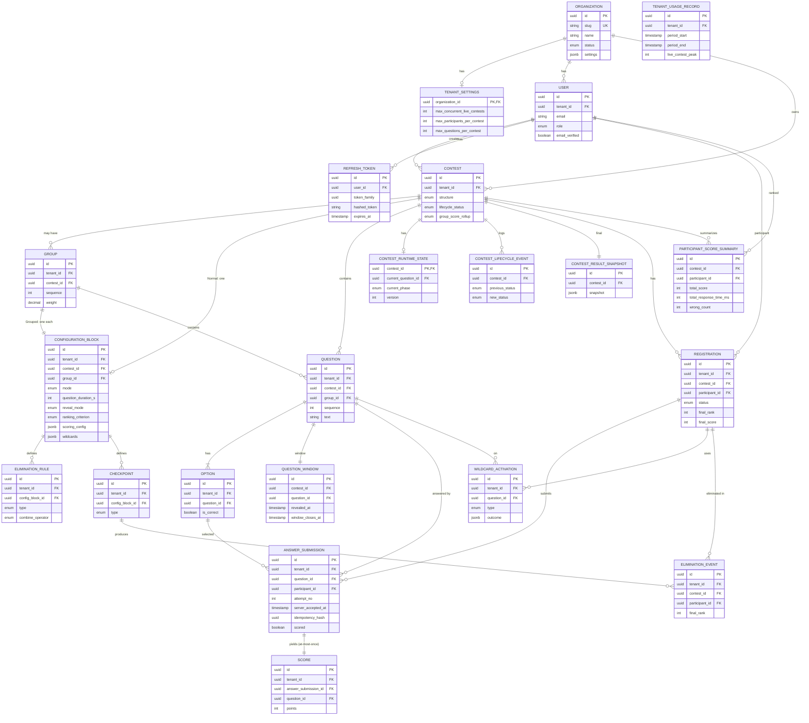

# ContestForge — Domain Model

| | |
|---|---|
| **Project** | ContestForge |
| **Source** | docs/spec/product-spec.md, docs/spec/technical-spec.md |
| **Date** | 2026-06-22 |
| **Status** | Draft v0.2 — remediated for DB modeling |

---

## 1. Bounded Contexts

ContestForge has six cohesive sub-domains within one service:

1. **Tenancy & Identity** — Organization, TenantSettings, User, RefreshToken/Session.
2. **Contest Authoring** — Contest, Group, ConfigurationBlock, Question, Option.
3. **Live Execution & Scoring** — Registration, QuestionWindow, ContestRuntimeState,
   AnswerSubmission, Score, WildcardActivation.
4. **Leaderboard & Results** — ParticipantScoreSummary, LeaderboardEntry (Redis),
   ContestResultSnapshot.
5. **Elimination** — Checkpoint, EliminationRule, EliminationEvent.
6. **Operations & Audit** — ContestLifecycleEvent, TenantUsageRecord.

All tenant-scoped entities carry `tenant_id` (Organization id). `User` with
role `SUPER_ADMIN` is platform-scoped (`tenant_id` is null). Composite foreign
keys include `tenant_id` to enforce isolation at the database level.

**Primary key convention:** UUIDv7 is used for all primary keys to improve
write locality on high-insert tables (`AnswerSubmission`, `Score`, etc.).

---

## 2. Core Entities

### Tenancy & Identity

**Organization (Tenant)**
- `id` (UUIDv7, PK)
- `slug` (string, unique, 3–64 chars, lowercase alphanumeric + hyphen) — used in
  login and URLs
- `name` (string)
- `status` (enum: ACTIVE | SUSPENDED)
- `settings` (JSONB) — tenant-level defaults and feature flags
- `created_by` (User id — Super Admin)
- `created_at`, `updated_at` (timestamp)
- *Index:* unique on `slug`

**TenantSettings** *(tenant-level configuration; one row per Organization)*
- `organization_id` (UUID, PK, FK → Organization)
- `max_concurrent_live_contests` (int, default 5)
- `max_participants_per_contest` (int, default 10_000)
- `max_questions_per_contest` (int, default 200)
- `default_negative_marking` (boolean, default false)
- `updated_at` (timestamp)

**User**
- `id` (UUIDv7, PK)
- `tenant_id` (UUID, FK → Organization; null only for SUPER_ADMIN)
- `email` (string)
- `password_hash` (string)
- `role` (enum: SUPER_ADMIN | ORG_ADMIN | MODERATOR | PARTICIPANT)
- `display_name` (string)
- `email_verified_at` (timestamp, nullable)
- `status` (enum: ACTIVE | DISABLED)
- `created_at`, `updated_at`
- *Unique:* `(tenant_id, email)` where `tenant_id` is not null.
- *Partial unique:* `(email)` where `role = SUPER_ADMIN` (platform-wide unique).

**RefreshToken / Session** *(JWT rotation and session metadata)*
- `id` (UUIDv7, PK)
- `user_id` (UUID, FK → User)
- `tenant_id` (UUID, FK → Organization; null for SUPER_ADMIN sessions)
- `token_family` (UUID — links rotated refresh tokens)
- `hashed_token` (string)
- `user_agent` (string, nullable)
- `ip_address` (string, nullable)
- `revoked_at` (timestamp, nullable)
- `expires_at` (timestamp)
- `created_at` (timestamp)
- *Index:* `(user_id, token_family)` for rotation validation.

---

### Contest Authoring

**Contest**
- `id` (UUIDv7, PK)
- `tenant_id` (UUID, FK → Organization)
- `name`, `description` (string)
- `structure` (enum: NORMAL | GROUPED)
- `lifecycle_status` (enum: DRAFT | PUBLISHED | REGISTRATION_OPEN |
  REGISTRATION_CLOSED | SCHEDULED | LIVE | COMPLETED | ARCHIVED)
- `scheduled_start_at` (timestamp, nullable)
- `group_score_rollup` (enum: SUM | WEIGHTED_SUM | BEST_N; Grouped only)
- `rollup_best_n` (int, nullable; when BEST_N)
- `created_by` (User id), `created_at`, `updated_at`
- *FK:* `(tenant_id, created_by)` references `User(tenant_id, id)` for tenant-scoped
  creators; Super Admin-created tenants use a nullable platform reference.
- *Index:* `(tenant_id, lifecycle_status)` for tenant contest listing.

**Group** (Grouped contests only)
- `id` (UUIDv7, PK)
- `tenant_id` (UUID, FK → Organization)
- `contest_id` (UUID, FK → Contest)
- `name` (string)
- `sequence` (int — run order)
- `weight` (decimal, nullable; for WEIGHTED_SUM)
- *FK:* `(tenant_id, contest_id)` references `Contest(tenant_id, id)`
- *Unique:* `(tenant_id, contest_id, sequence)`

**ConfigurationBlock**
- `id` (UUIDv7, PK)
- `tenant_id` (UUID, FK → Organization)
- `contest_id` (UUID, FK → Contest) — set when scope = CONTEST (Normal)
- `group_id` (UUID, FK → Group, nullable) — set when scope = GROUP (Grouped)
- `mode` (enum: STANDARD | SPEED | ELIMINATION)
- `question_duration_s` (int, 5–300)
- `question_interval_s` (int, 0–60)
- `explanation_duration_s` (int, 0–60)
- `leaderboard_duration_s` (int, 0–60)
- `reveal_mode` (enum: AUTOMATIC | MODERATOR_CONTROLLED)
- `ranking_criterion` (enum: SCORE_ONLY | SCORE_TIME | ACCURACY)
- `tie_display` (enum: SHARED_RANK | FASTEST | LEAST_INCORRECT)
- `leaderboard_visibility` (enum: ALWAYS | POST_QUESTION | HIDDEN | MASKED)
- `update_frequency` (enum: PER_ANSWER | PER_QUESTION | PER_GROUP)
- **Scoring config (JSONB, validated by mode):**
  - `correct_points` (int, default 10; Fixed)
  - `wrong_points` (int, default 0; may be negative; Fixed)
  - `second_chance_rate` (decimal, default 0.5)
  - `time_bands` (array; Speed) or `decay` `{max_points, floor, decay_rate}` (Speed)
- **Wildcards (JSONB, validated schema):** enabled set, usage limits,
  eligibility, cooldown, group carryover.
- *FKs:* `(tenant_id, contest_id)` references `Contest(tenant_id, id)`;
  `(tenant_id, group_id)` references `Group(tenant_id, id)`
- *CHECK:* exactly one of (`contest_id`, `group_id`) is not null.
- *Partial unique:* `(tenant_id, contest_id)` where `group_id` is null;
  `(tenant_id, group_id)` where `contest_id` is null.

**Question**
- `id` (UUIDv7, PK)
- `tenant_id` (UUID, FK → Organization)
- `contest_id` (UUID, FK → Contest)
- `group_id` (UUID, FK → Group, nullable; Grouped)
- `sequence` (int)
- `text` (string)
- `explanation` (string, nullable)
- `created_at`, `updated_at`
- *FKs:* `(tenant_id, contest_id)` references `Contest(tenant_id, id)`;
  `(tenant_id, group_id)` references `Group(tenant_id, id)`
- *Partial unique:* `(tenant_id, contest_id, sequence)` where `group_id` is null;
  `(tenant_id, group_id, sequence)` where `group_id` is not null.

**Option**
- `id` (UUIDv7, PK)
- `tenant_id` (UUID, FK → Organization)
- `question_id` (UUID, FK → Question)
- `text` (string)
- `is_correct` (boolean)
- `ordinal` (int)
- *FK:* `(tenant_id, question_id)` references `Question(tenant_id, id)`
- *Unique:* `(tenant_id, question_id, ordinal)`
- *Partial unique:* `(tenant_id, question_id)` where `is_correct = true`
  (exactly one correct option per question).

---

### Live Execution & Scoring

**Registration**
- `id` (UUIDv7, PK)
- `tenant_id` (UUID, FK → Organization)
- `contest_id` (UUID, FK → Contest)
- `participant_id` (UUID, FK → User)
- `status` (enum: REGISTERED | ACTIVE | ELIMINATED | COMPLETED)
- `final_rank` (int, nullable)
- `final_score` (int, nullable)
- `registered_at`
- *FKs:* `(tenant_id, contest_id)` references `Contest(tenant_id, id)`;
  `(tenant_id, participant_id)` references `User(tenant_id, id)`
- *Unique:* `(tenant_id, contest_id, participant_id)`

**QuestionWindow** *(server-authoritative timing per question)*
- `id` (UUIDv7, PK)
- `tenant_id` (UUID, FK → Organization)
- `contest_id` (UUID, FK → Contest)
- `question_id` (UUID, FK → Question)
- `group_id` (UUID, FK → Group, nullable)
- `sequence` (int)
- `revealed_at` (timestamp, nullable)
- `window_closes_at` (timestamp, nullable)
- `evaluated_at` (timestamp, nullable)
- *FKs:* `(tenant_id, contest_id)` references `Contest(tenant_id, id)`;
  `(tenant_id, question_id)` references `Question(tenant_id, id)`
- *Unique:* `(tenant_id, contest_id, question_id)`
- *Index:* `(tenant_id, contest_id, sequence)` for ordered recovery.

**ContestRuntimeState** *(singleton per contest; enables fast reconnect/recovery)*
- `contest_id` (UUID, PK, FK → Contest)
- `tenant_id` (UUID, FK → Organization)
- `current_group_id` (UUID, nullable)
- `current_question_id` (UUID, nullable)
- `current_phase` (enum: IDLE | REVEAL | SUBMISSION | EXPLANATION | LEADERBOARD | INTERVAL)
- `active_participant_count` (int)
- `version` (int) — optimistic lock
- `updated_at` (timestamp)
- *FK:* `(tenant_id, contest_id)` references `Contest(tenant_id, id)`

**AnswerSubmission** *(durable answer record — durability boundary)*
- `id` (UUIDv7, PK)
- `tenant_id` (UUID, FK → Organization)
- `contest_id` (UUID, FK → Contest)
- `question_id` (UUID, FK → Question)
- `participant_id` (UUID, FK → User)
- `attempt_no` (int; 1 = first, 2 = Second Chance)
- `selected_option_id` (UUID, FK → Option, nullable for skip/timeout)
- `server_accepted_at` (timestamp — authoritative scoring time, FR-40)
- `response_time_ms` (int — from reveal to accept; for Speed/tie-break)
- `outcome` (enum: CORRECT | WRONG | TIMEOUT | SKIPPED)
- `idempotency_hash` (UUID — deterministic hash of `contest_id|question_id|participant_id|attempt_no`)
- `idempotency_debug` (string — human-readable form of the idempotency inputs)
- `scored` (boolean, default false) — set true once the Score row is written
- *FKs:* `(tenant_id, contest_id)` references `Contest(tenant_id, id)`;
  `(tenant_id, question_id)` references `Question(tenant_id, id)`;
  `(tenant_id, participant_id)` references `User(tenant_id, id)`;
  `(tenant_id, selected_option_id)` references `Option(tenant_id, id)`
- *Unique:* `(tenant_id, idempotency_hash)`
- *Index:* `(tenant_id, contest_id, question_id, participant_id, attempt_no)`
- *Partitioning:* by `HASH(contest_id)` into 64 partitions.

**Score**
- `id` (UUIDv7, PK)
- `tenant_id` (UUID, FK → Organization)
- `contest_id` (UUID, FK → Contest)
- `group_id` (UUID, nullable)
- `question_id` (UUID, FK → Question) — denormalized for audit
- `participant_id` (UUID, FK → User)
- `answer_submission_id` (UUID, FK → AnswerSubmission)
- `scoring_model` (enum: FIXED | TIME_BASED) — denormalized for audit
- `points` (int)
- `scored_at` (timestamp)
- *FKs:* `(tenant_id, contest_id)` references `Contest(tenant_id, id)`;
  `(tenant_id, group_id)` references `Group(tenant_id, id)`;
  `(tenant_id, question_id)` references `Question(tenant_id, id)`;
  `(tenant_id, participant_id)` references `User(tenant_id, id)`;
  `(tenant_id, answer_submission_id)` references `AnswerSubmission(tenant_id, id)`
- *Unique:* `(tenant_id, answer_submission_id)`
- *Partitioning:* by `HASH(contest_id)` into 64 partitions (aligned with AnswerSubmission).

**WildcardActivation**
- `id` (UUIDv7, PK)
- `tenant_id` (UUID, FK → Organization)
- `contest_id` (UUID, FK → Contest)
- `question_id` (UUID, FK → Question)
- `participant_id` (UUID, FK → User)
- `type` (enum: FIFTY_FIFTY | SECOND_CHANCE | SKIP)
- `activated_at` (timestamp)
- `outcome` (JSONB — e.g. `{ "removed_options": [...], "points_effect": ... }`)
- *FKs:* `(tenant_id, contest_id)` references `Contest(tenant_id, id)`;
  `(tenant_id, question_id)` references `Question(tenant_id, id)`;
  `(tenant_id, participant_id)` references `User(tenant_id, id)`

**LeaderboardEntry** *(materialized/cached in Redis; rebuildable)*
- Redis key namespace: `tenant:{tenant_id}:contest:{contest_id}:group:{group_id}:view:{view}`
- `participant_id`
- `score`, `total_time_ms`, `wrong_count`, `last_correct_at`
- `rank`

---

### Elimination

**EliminationRule**
- `id` (UUIDv7, PK)
- `tenant_id` (UUID, FK → Organization)
- `config_block_id` (UUID, FK → ConfigurationBlock)
- `type` (enum: FIRST_WRONG | N_WRONG | BOTTOM_X_PERCENT | MIN_SCORE)
- `n_value` (int, nullable; N_WRONG, default 3)
- `percent_value` (decimal, nullable; BOTTOM_X_PERCENT)
- `min_score` (int, nullable; MIN_SCORE)
- `combine_operator` (enum: AND | OR — combination within the block)
- *FK:* `(tenant_id, config_block_id)` references `ConfigurationBlock(tenant_id, id)`

**Checkpoint**
- `id` (UUIDv7, PK)
- `tenant_id` (UUID, FK → Organization)
- `config_block_id` (UUID, FK → ConfigurationBlock)
- `type` (enum: AFTER_QUESTION | AFTER_GROUP | CUSTOM_MILESTONE)
- `question_sequence` (int, nullable; AFTER_QUESTION)
- `milestone_at` (timestamp, nullable; CUSTOM_MILESTONE)
- *FK:* `(tenant_id, config_block_id)` references `ConfigurationBlock(tenant_id, id)`

**EliminationEvent**
- `id` (UUIDv7, PK)
- `tenant_id` (UUID, FK → Organization)
- `contest_id` (UUID, FK → Contest)
- `participant_id` (UUID, FK → User)
- `checkpoint_id` (UUID, FK → Checkpoint)
- `final_rank` (int), `final_score` (int)
- `eliminated_at` (timestamp)
- `spectator_granted` (boolean)
- *FKs:* `(tenant_id, contest_id)` references `Contest(tenant_id, id)`;
  `(tenant_id, participant_id)` references `User(tenant_id, id)`;
  `(tenant_id, checkpoint_id)` references `Checkpoint(tenant_id, id)`
- *Unique:* `(tenant_id, contest_id, participant_id)`

---

### Leaderboard & Results

**ParticipantScoreSummary** *(derived aggregate; rebuildable from Score)*
- `id` (UUIDv7, PK)
- `tenant_id` (UUID, FK → Organization)
- `contest_id` (UUID, FK → Contest)
- `group_id` (UUID, nullable)
- `participant_id` (UUID, FK → User)
- `total_score` (int)
- `total_response_time_ms` (int)
- `wrong_count` (int)
- `last_correct_at` (timestamp, nullable)
- `updated_at` (timestamp)
- *FKs:* `(tenant_id, contest_id)` references `Contest(tenant_id, id)`;
  `(tenant_id, participant_id)` references `User(tenant_id, id)`
- *Unique:* `(tenant_id, contest_id, group_id, participant_id)`
- *Note:* This table is derived from `Score` and `AnswerSubmission`. It exists
  to speed up leaderboard computation and rebuilds; cache loss does not affect
  it because it can be recomputed from authoritative data (FR-44).

**ContestResultSnapshot** *(immutable final ranking written on Archive)*
- `id` (UUIDv7, PK)
- `tenant_id` (UUID, FK → Organization)
- `contest_id` (UUID, FK → Contest)
- `snapshot` (JSONB — ordered list of `{ participant_id, rank, score, ... }`)
- `created_at` (timestamp)
- *FK:* `(tenant_id, contest_id)` references `Contest(tenant_id, id)`
- *Unique:* `(tenant_id, contest_id)`

---

### Operations & Audit

**ContestLifecycleEvent** *(audit log of contest status transitions)*
- `id` (UUIDv7, PK)
- `tenant_id` (UUID, FK → Organization)
- `contest_id` (UUID, FK → Contest)
- `previous_status` (enum lifecycle status)
- `new_status` (enum lifecycle status)
- `triggered_by` (User id)
- `metadata` (JSONB, nullable)
- `created_at` (timestamp)
- *FK:* `(tenant_id, contest_id)` references `Contest(tenant_id, id)`
- *Index:* `(tenant_id, contest_id, created_at)`

**TenantUsageRecord** *(periodic aggregate; foundation for billing and capacity planning)*
- `id` (UUIDv7, PK)
- `tenant_id` (UUID, FK → Organization)
- `period_start`, `period_end` (timestamp)
- `contests_created` (int)
- `live_contest_peak` (int)
- `participant_minutes` (bigint)
- `questions_created` (int)
- `answer_submissions` (int)
- `wildcard_activations` (int)
- `storage_bytes` (bigint)
- `updated_at` (timestamp)

---

## 3. Physical Database Design

### 3.1 Tenant isolation strategy

- **Application-enforced:** every repository query includes `tenant_id` filter
  via a SQLAlchemy mixin; unscoped queries fail closed in production.
- **Database-enforced:** composite foreign keys include `tenant_id` so a row
  cannot reference a parent in another tenant even if a bug injects the wrong ID.
- **Defense in depth:** optional PostgreSQL Row-Level Security (RLS) policies
  enforce `tenant_id` filtering at the database level.
- **Super Admin:** platform-scoped users operate outside tenant filters but
  cannot mutate tenant data without explicit tenant context.

### 3.2 Indexing strategy

Hot-path indexes:

- `registration` — unique `(tenant_id, contest_id, participant_id)`; index
  `(tenant_id, contest_id, status)`.
- `answer_submission` — unique `(tenant_id, idempotency_hash)`; index
  `(tenant_id, contest_id, question_id, participant_id, attempt_no)`; index
  `(tenant_id, contest_id, scored)` for recovery re-drive.
- `score` — unique `(tenant_id, answer_submission_id)`; index
  `(tenant_id, contest_id, participant_id)`.
- `question_window` — unique `(tenant_id, contest_id, question_id)`; index
  `(tenant_id, contest_id, sequence)`.
- `contest_runtime_state` — PK on `contest_id`.
- `participant_score_summary` — unique
  `(tenant_id, contest_id, group_id, participant_id)`.

Partial unique indexes:

- `configuration_block` — one Normal block per contest; one block per group.
- `option` — exactly one correct option per question.
- `question` — sequence unique within contest or within group.

### 3.3 Partitioning strategy

- `answer_submission` is partitioned by `HASH(contest_id)` into 64 partitions
  to spread write load during high-concurrency contests.
- `score` is co-partitioned by `HASH(contest_id)` into 64 partitions so joins
  between `answer_submission` and `score` stay partition-local.
- `participant_score_summary` may be partitioned by `HASH(contest_id)` if
  leaderboard rebuild latency becomes a bottleneck.

### 3.4 High-write optimizations

- **UUIDv7 PKs** improve index locality over random UUIDv4 on high-insert tables.
- **`server_accepted_at`** is set by a PostgreSQL trigger using
  `clock_timestamp()` to guarantee monotonic, authoritative timestamps.
- **Idempotency** uses a deterministic UUID hash instead of a string concatenation
  for fast equality checks and smaller index size.
- **Batch upserts** are used when rebuilding `participant_score_summary` from
  `Score` rows after cache loss or recovery.
- **Connection pooling** via asyncpg/SQLAlchemy (min 10 / max 100 per instance);
  PgBouncer in transaction-pooling mode if needed.
- **Synchronous commit** remains the default for answer writes; the durability
  boundary is the PostgreSQL commit before the client ack.

### 3.5 Enum representation

- PostgreSQL native `ENUM` types for low-cardinality, stable enums
  (`lifecycle_status`, `role`, `mode`, `outcome`, etc.).
- `smallint` with Python enum mapping may be used for the hottest tables
  (`answer_submission`, `score`) if benchmarked as faster; migration path is
  a simple column cast.

### 3.6 Archival strategy

- `Archived` is a lifecycle status, not a separate table. No data migration
  occurs on archive.
- `ContestResultSnapshot` is written once when a contest enters `Archived`
  to provide an immutable final ranking without recomputation.
- Historical `answer_submission` and `score` partitions may be detached after
  a tenant-configurable retention period (post-MVP).
- `contest_lifecycle_event` and `wildcard_activation` audit data are retained
  for 1 year.

---

## 4. Entity Relationship Diagram

---

## 5. Business Rules

- **BR-1 (Tenant isolation):** Every tenant-scoped query is filtered by
  `tenant_id`; no entity may reference another tenant's entity. (FR-3)
- **BR-2 (Structure ↔ config placement):** Normal → exactly one
  ConfigurationBlock at contest scope; Grouped → exactly one ConfigurationBlock
  per Group. (FR-8)
- **BR-3 (Mode → scoring):** STANDARD and ELIMINATION ⇒ Fixed scoring; SPEED ⇒
  Time-Based. Scoring model is never set independently of `mode`. (FR-12)
- **BR-4 (Elimination requires rules):** ELIMINATION mode blocks must have ≥1
  EliminationRule and ≥1 Checkpoint; non-ELIMINATION blocks ignore them. (FR-10,
  FR-33)
- **BR-5 (Lifecycle monotonicity):** lifecycle_status advances only through the
  fixed sequence; no skipping. Structure locks at PUBLISHED; ConfigurationBlock
  locks at REGISTRATION_OPEN. (FR-7, FR-9)
- **BR-6 (Config field ranges):** durations honor PRD bounds (question 5–300s;
  interval/explanation/leaderboard 0–60s). (FR-10)
- **BR-7 (Authoritative timestamp):** `AnswerSubmission.server_accepted_at` is
  set once, at first server acceptance, and is the scoring/tie-break time even
  after retries. (FR-40)
- **BR-8 (At-most-once scoring):** `Score.answer_submission_id` is unique; a
  given AnswerSubmission yields exactly one Score. (FR-39)
- **BR-9 (Late submission):** an answer with accept time after the server-side
  window close is rejected (recorded as TIMEOUT or not accepted). (FR-20)
- **BR-10 (Second Chance):** only one extra attempt (attempt_no = 2) after a
  WRONG first attempt; scored at `second_chance_rate`. (FR-24)
- **BR-11 (Fifty-Fifty timing):** cannot be activated after an answer is
  selected; always preserves the correct option. (FR-23)
- **BR-12 (Skip scoring):** Skip awards full correct points under Fixed, floor
  score under Speed. (FR-25)
- **BR-13 (Wildcard limits):** activations respect enabled set, usage limit,
  eligibility, cooldown, and group carryover/reset. (FR-26)
- **BR-14 (Tie-break order):** fastest total time → fewest wrong → earliest last
  correct submission; deterministic and logged. (FR-15)
- **BR-15 (Group rollup):** contest score computed by the contest's rollup
  strategy (SUM | WEIGHTED_SUM | BEST_N). (FR-16)
- **BR-16 (Elimination effect):** once an EliminationEvent exists for a
  participant, their Registration.status = ELIMINATED and no further
  AnswerSubmissions are accepted. (FR-36)
- **BR-17 (Survivor carry-forward):** survivors retain accumulated scores across
  groups unless a reset is configured. (FR-37)
- **BR-18 (Leaderboard recoverability):** LeaderboardEntry and
  ParticipantScoreSummary are derived state; rebuilt from authoritative Score
  rows on cache loss without affecting scores/ranks. (FR-44)
- **BR-19 (Email uniqueness):** `User.email` is unique within a tenant;
  Super Admin emails are unique platform-wide. (FR-4)
- **BR-20 (Configuration scope invariant):** a ConfigurationBlock has exactly one
  of (`contest_id`, `group_id`). (FR-8)
- **BR-21 (Exactly one correct option):** each Question has exactly one Option
  with `is_correct = true`. (FR-10)
- **BR-22 (Question window authority):** `QuestionWindow` holds the
  server-authoritative reveal, close, and evaluation times; client times are
  display-only. (FR-17, FR-20)
- **BR-23 (Runtime state singleton):** at most one authoritative
  ContestRuntimeState row exists per contest; updates use optimistic locking.
  (NFR-6, NFR-7)
- **BR-24 (Refresh token rotation):** refresh tokens belong to a token family;
  reuse of a revoked token revokes the entire family. (FR-4)
- **BR-25 (Archived immutability):** once a Contest is Archived, its
  ConfigurationBlock, Questions, Options, AnswerSubmissions, and Scores are
  read-only. (FR-45)
- **BR-26 (Idempotency):** the same `(contest_id, question_id, participant_id,
  attempt_no)` produces the same `idempotency_hash`; duplicate hashes within a
  tenant are rejected. (FR-39, FR-41)
- **BR-27 (Result snapshot immutability):** a ContestResultSnapshot is written
  once when a contest is Archived and never modified. (FR-45)
